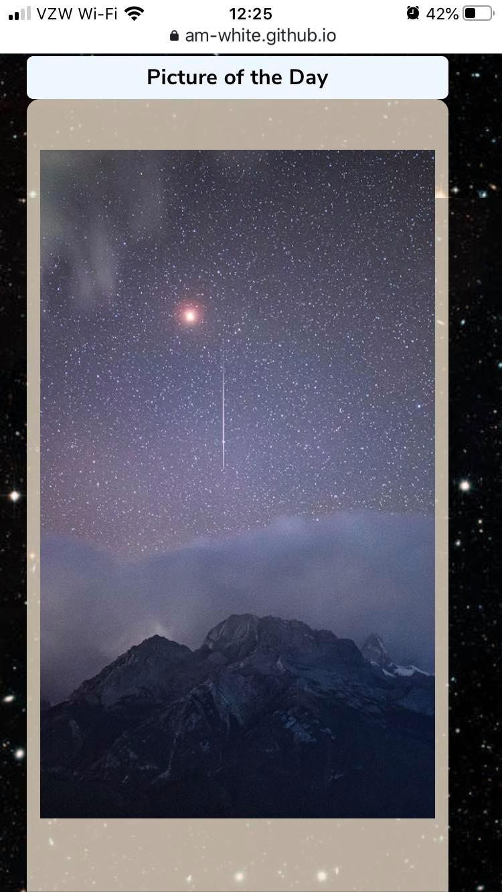

# NASA Image Search Engine

This application generates images and information based on the users search entry.

---

## Description

NASA Image Search Engine is a responsive web app that displays images and information about space, stars and planets. The user enters a desired word and when the search button is pressed results appear using two NASA API's and one Wikipedia API. A picture of the day will also appear in a side card, whatever picture is shown was taken on the same date as today (with the exception of the year).

Users can then hover over their result images and click one of the heart buttons to add it to a list of favorite images. This is connected to local storage and will be saved even if the user refreshes.

---

## Table of Contents

* [Installation](#Installation)
* [Usage](#Usage)
* [Images](#Images)
* [Credits](#Credits)
* [License](#License)

---

## Installation

1. Clone the Github Repository [here](https://github.com/Am-White/ProjectUno).
2. Open index.html in browser.

---

## Usage
* Visit the deployed app: [NASA Search Engine](https://am-white.github.io/ProjectUno/)
    1. Enter word related to space into search area and press the "Search" button to show results.
    2. View Images displayed in the result cards, and click on the heart button to save that image to your local storage.
    3. Bonus: Find hidden "Easter Egg button" and be transported toa super cool interactive space website to learn more.

* Visit Github to track changes that were made or to clone the repo: [Github Repo](https://github.com/Am-White/ProjectUno).

---

## Images

### Application Upon Load
#### Laptop

#### Mobile Phone

### Picture of the Day
#### Laptop
 
#### Mobile Phone 
 

### Query and Results
#### Laptop
 
#### Mobile Phone 
 

### Favorites
#### Laptop Phone 
  
#### Mobile Phone 
  

---

## Credits
Thank you to Jamey Gronewald for the README template, and thank you to Anothony Brown for all of the knowledge given to be able to produce this first project.

---

## Collaborators
Front end developers:
Amethyst White, and Chetan Sekhon.

Back end developers:
Frederick Thomas, Hasan Utku, AND Yuwen Yu

---

## License
MIT License

Copyright (c) [2020] [Amethyst White, Hasan Utku, Ywuen Yu, Frederick Thomas, and Chetan Sekhon]

Permission is hereby granted, free of charge, to any person obtaining a copy of this software and associated documentation files (the "Software"), to deal in the Software without restriction, including without limitation the rights to use, copy, modify, merge, publish, distribute, sublicense, and/or sell copies of the Software, and to permit persons to whom the Software is furnished to do so, subject to the following conditions:

The above copyright notice and this permission notice shall be included in all copies or substantial portions of the Software.

THE SOFTWARE IS PROVIDED "AS IS", WITHOUT WARRANTY OF ANY KIND, EXPRESS OR IMPLIED, INCLUDING BUT NOT LIMITED TO THE WARRANTIES OF MERCHANTABILITY, FITNESS FOR A PARTICULAR PURPOSE AND NONINFRINGEMENT. IN NO EVENT SHALL THE AUTHORS OR COPYRIGHT HOLDERS BE LIABLE FOR ANY CLAIM, DAMAGES OR OTHER LIABILITY, WHETHER IN AN ACTION OF CONTRACT, TORT OR OTHERWISE, ARISING FROM, OUT OF OR IN CONNECTION WITH THE SOFTWARE OR THE USE OR OTHER DEALINGS IN THE SOFTWARE.
